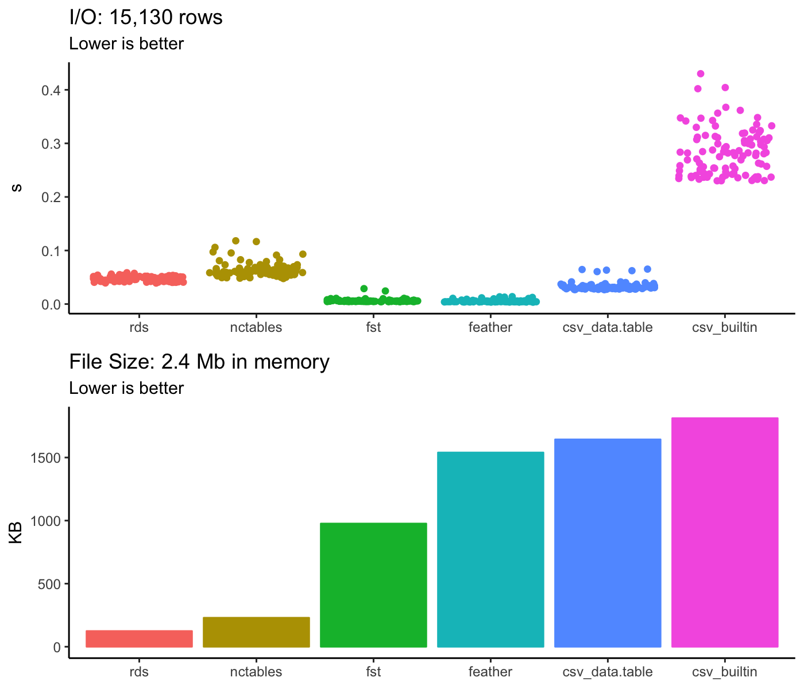
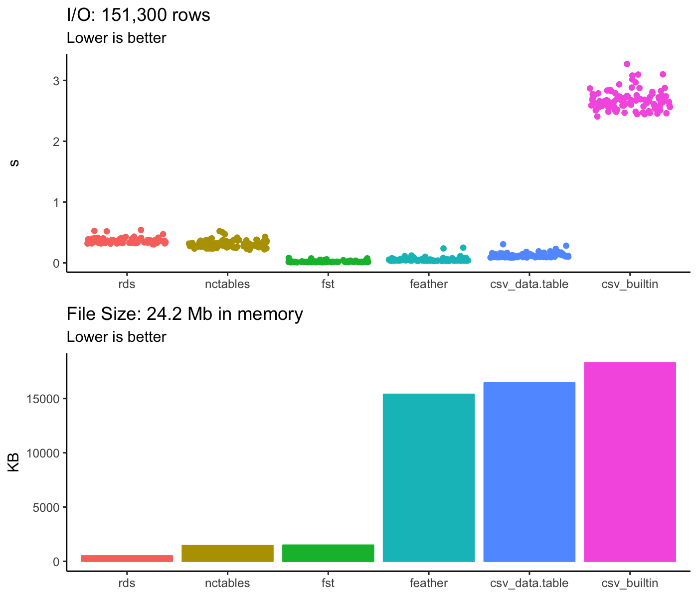

# nctables

Minimal tools for lightning fast data frame serialization in R built on NetCDF4 for language interoperability.

## Installation

You can install the development version of nctables from GitHub using `devtools`.

``` r
install.packages('devtools')
devtools::install_github('benfasoli/nctables')
```

## Example

Let's grab some free timeseries data from the [Alpha Vantage API](https://www.alphavantage.co/documentation/).

``` r
df <- read.csv(paste0('https://www.alphavantage.co/query',
                      '?function=TIME_SERIES_INTRADAY',
                      '&symbol=MSFT',
                      '&interval=5min',
                      '&apikey=demo',
                      '&datatype=csv'),
               stringsAsFactors = F)
df$timestamp <- as.POSIXct(df$timestamp, tz = 'US/Eastern')
attributes(df$timestamp)$tzone <- 'UTC'
str(df)
# 'data.frame':	100 obs. of  6 variables:
#  $ timestamp: POSIXct, format: "2019-03-15 16:45:00" "2019-03-15 16:40:00" "2019-03-15 16:35:00" ...
#  $ open     : num  117 117 117 117 117 ...
#  $ high     : num  117 117 117 117 117 ...
#  $ low      : num  117 117 117 117 117 ...
#  $ close    : num  117 117 117 117 117 ...
#  $ volume   : int  175834 187452 199422 340355 348412 248650 261843 415004 289021 236358 ...
```

Using the `timestamp` column as our only dimension, serialize the data to a NetCDF file and read the result back into a data frame.

```r
nct_create(df, filename = 'filename.nc', dims = 'timestamp')
df_nct <- nct_read('filename.nc')
str(df_nct)
# 'data.frame':	100 obs. of  6 variables:
#  $ timestamp: POSIXct, format: "2019-03-15 16:45:00" "2019-03-15 16:40:00" "2019-03-15 16:35:00" ...
#  $ open     : num  117 117 117 117 117 ...
#  $ high     : num  117 117 117 117 117 ...
#  $ low      : num  117 117 117 117 117 ...
#  $ close    : num  117 117 117 117 117 ...
#  $ volume   : int  175834 187452 210067 340355 348412 248650 261843 415004 289021 236358 ...
```

Inspecting the output file more closely using the `ncdump` command line utility -

```bash
> ncdump -h filename.nc
# netcdf filename {
# dimensions:
#         timestamp = UNLIMITED ; // (100 currently)
# variables:
#         double timestamp(timestamp) ;
#                 timestamp:units = "seconds since 1970-01-01T00:00:00Z" ;
#                 timestamp:long_name = "timestamp" ;
#                 timestamp:calendar = "standard" ;
#                 timestamp:nct_type = "datetime" ;
#         float open(timestamp) ;
#                 open:nct_type = "float" ;
#         float high(timestamp) ;
#                 high:nct_type = "float" ;
#         float low(timestamp) ;
#                 low:nct_type = "float" ;
#         float close(timestamp) ;
#                 close:nct_type = "float" ;
#         int volume(timestamp) ;
#                 volume:nct_type = "integer" ;
# }
```

### Fully qualified metadata

The above example works well for datasets that don't require much documentation but NetCDF provides dedicated fields for metadata that can explicitly document variable descriptions and units. These fields are required for conformance with the [NetCDF CF Metadata Convention](http://cfconventions.org/) and can be specified when creating a new `nctables` file.

```r
nct_create(df,
           filename = 'filename.nc',
           dims = 'timestamp',
           longnames = list(timestamp = 'inverval end time',
                            open = 'inverval open price',
                            high = 'inverval high price',
                            low = 'inverval low price',
                            close = 'interval close price',
                            volume = 'shares traded'),
           units = list(timestamp = 'seconds since 1970-01-01T00:00:00Z',
                        open = 'USD',
                        high = 'USD',
                        low = 'USD',
                        close = 'USD',
                        volume = 'shares'))
```

```bash
> ncdump -h filename.nc
# netcdf filename {
# dimensions:
#         timestamp = UNLIMITED ; // (100 currently)
# variables:
#         double timestamp(timestamp) ;
#                 timestamp:units = "seconds since 1970-01-01T00:00:00Z" ;
#                 timestamp:long_name = "inverval end time" ;
#                 timestamp:calendar = "standard" ;
#                 timestamp:nct_type = "datetime" ;
#         float open(timestamp) ;
#                 open:units = "USD" ;
#                 open:long_name = "inverval open price" ;
#                 open:nct_type = "float" ;
#         float high(timestamp) ;
#                 high:units = "USD" ;
#                 high:long_name = "inverval high price" ;
#                 high:nct_type = "float" ;
#         float low(timestamp) ;
#                 low:units = "USD" ;
#                 low:long_name = "inverval low price" ;
#                 low:nct_type = "float" ;
#         float close(timestamp) ;
#                 close:units = "USD" ;
#                 close:long_name = "interval close price" ;
#                 close:nct_type = "float" ;
#         int volume(timestamp) ;
#                 volume:units = "shares" ;
#                 volume:long_name = "shares traded" ;
#                 volume:nct_type = "integer" ;
# }
```

## Benchmarks

Benchmarks were done on a Macbook with a 2.9 GHz i7 CPU and 16GB RAM. `data.table` and `fst` functions were allowed to use the maximum number of available threads. With ~15,000 rows -

<p align="center">
  
</p>

and with ~150,000 rows -

<p align="center">
  
</p>
